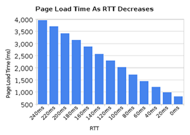

# 2. HTTP today

HTTP 1.1 has turned into a protocol used for virtually everything on the Internet. Huge investments have been done on protocols and infrastructure that take advantage of this. This is taken to the extent that it is often easier today to make things run on top of HTTP rather than building something new on its own.

## 2.1 HTTP 1.1 is huge

When HTTP was created and thrown out into the world it was probably perceived as a rather simple and straightforward protocol, but time has proved that to be false. HTTP 1.0 in RFC 1945 is a 60 page specification released in 1996. RFC 2616 that describes HTTP 1.1 was released only three years later in 1999 and had grown significantly to 176 pages. Yet, when we within IETF worked on the update to that spec, it was split up and converted into six documents, with a much larger page count in total (resulting in RFC 7230 and family). By any count, HTTP 1.1 is big and includes a myriad of details, subtleties and not the least a lot of optional parts.

## 2.2 A world of options

HTTP 1.1's nature of having lots of tiny details and options available for later extensions have grown a software ecosystem where almost no implementations ever implement everything – and it isn't even really possible to exactly tell what “everything” is. This has lead to a situation where features that were initially little used saw very few implementations and those who did implement the features then saw very little use of them.

Then later on, it caused an interoperability problem when clients and servers started to increase the use of such features. HTTP Pipelining is a primary example of such a feature.

## 2.3 Inadequate use of TCP

HTTP 1.1 has a hard time really taking full advantage of all the power and performance that TCP offers. HTTP clients and browsers have to be very creative to find solutions that decrease page load times.

Other attempts that have been going on in parallel over the years have also confirmed that TCP is not that easy to replace and thus we keep working on improving both TCP and the protocols on top of it.

Simply put, TCP can be utilized better to avoid pauses or moments in time that could have been used to send or receive more data. The following sections will highlight some of these shortcomings.

## 2.4 Transfer sizes and number of objects

When looking at the trend for some of the most popular sites on the web today and what it takes to download their front pages, a clear pattern emerges. Over the years the amount of data that needs to be retrieved has gradually risen up to and above 1.9MB . What is more important in this context is that on average over a hundred individual resources are required to display each page.

As the graph below shows, the trend has been going on for a while and there is little to no indication that it'll change anytime soon. It shows the growth of the total transfer size (in green) and the total number of requests used on average (in red) to serve the most popular web sites in the world, and how they have changed over the last four years.

## 2.5 Latency kills

HTTP 1.1 is very latency sensitive, partly because HTTP Pipelining is still riddled with enough problems to remain switched off to a large percentage of users.

While we've seen a great increase in available bandwidth to people over the last few years, we have not seen the same level of improvements in reducing latency. High latency links, like many of the current mobile technologies, make it really hard to get a good and fast web experience even if you have a really high bandwidth connection.

Another use case that really needs low latency is certain kinds of video, like video conferencing, gaming and similar where there's not just a pre-generated stream to send out.

## 2.6. Head of line blocking</h2>

HTTP Pipelining is a way to send another request while waiting for the response to a previous request. It is very similar to queuing at a counter at the bank or in a super market. You just don't know if the person in front of you is a quick customer or that annoying one that will take forever before he/she is done: head of line blocking.

Sure you can be careful about line picking so that you pick the one you really believe is the correct one, and at times you can even start a new line of your own but in the end you can't avoid making a decision and once it is made you cannot switch lines.

Creating a new line is also associated with a performance and resource penalty so that's not scalable beyond a smaller number of lines. There's just no perfect solution to this.

Even today, 2015, most desktop web browsers ship with HTTP pipelining disabled by default.

Additional reading on this subject can be found for example in the Firefox [bugzilla entry 2643541](https://bugzilla.mozilla.org/show_bug.cgi?id=264354).
