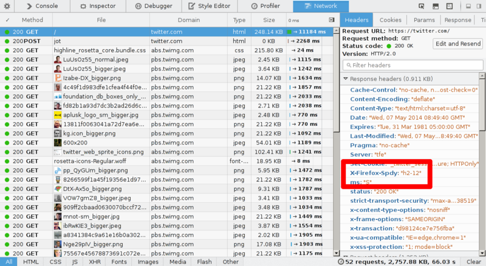

# 9. Firefoxにおけるhttp2

Firefoxはとても緊密にドラフトに追随していて、何ヶ月もの間http2テスト実装を提供してきました。
http2プロトコルの開発中、クライアントとサーバーはどのドラフトバージョンを実装しているかについて合意する必要があり、テストを行うときに若干厄介でした。クライアントとサーバーがそれらの実装するプロトコルドラフトが何なのか合意しているか気を付けてください。

## 9.1. まず最初にhttp2が有効になっているか確かめてください

2015年1月13日にリリースされたFirefox 35から、http2サポートがデフォルトで有効になっています。

アドレスバーに'about:config'と入力し、”network.http.spdy.enabled.http2draft”という名前のオプションを探してください。それが*true*になっているか確認してください。Firefox 36は”network.http.spdy.enabled.http2”という名前の別のオプションを導入し、デフォルトで*true*に設定されています。後者はhttp2”標準”バージョンを制御するのに対し、前者はドラフト時代のhttp2バージョンのネゴシエーションを有効／無効化します。両方ともFirefox 36からデフォルトでtrueになっています。

## 9.2. TLS限定

Firefoxはhttp2をTLS上でのみ実装することを忘れないでください。Firefoxではhttps://のhttp2をサポートするサイトでのみhttp2は動作します。

## 9.3. 透過的！

http2が使われているかどうかを示すUIはありません。簡単にはわからないようになっています。確かめる一つの方法は、”Web developer->Network”を開いてレスポンスヘッダーを見て、サーバーが何を返しているかを見ることです。上のスクリーンショットに見るとおり、レスポンスは”HTTP/2.0”であり、Firefoxが”X-Firefox-Spdy:”という独自ヘッダーを挿入します。

ネットワークツールで見ることができるヘッダーはhttp2のバイナリーフォーマットから古いHTTP 1.xスタイルのヘッダーに変換されています。

## 9.4. http2の使用を可視化する

サイトがhttp2を使用しているかどうかの可視化を手伝いするFirefoxプラグインがあります。それらの一つは[”SPDY Indicator”](https://addons.mozilla.org/en-US/firefox/addon/spdy-indicator/)です。
